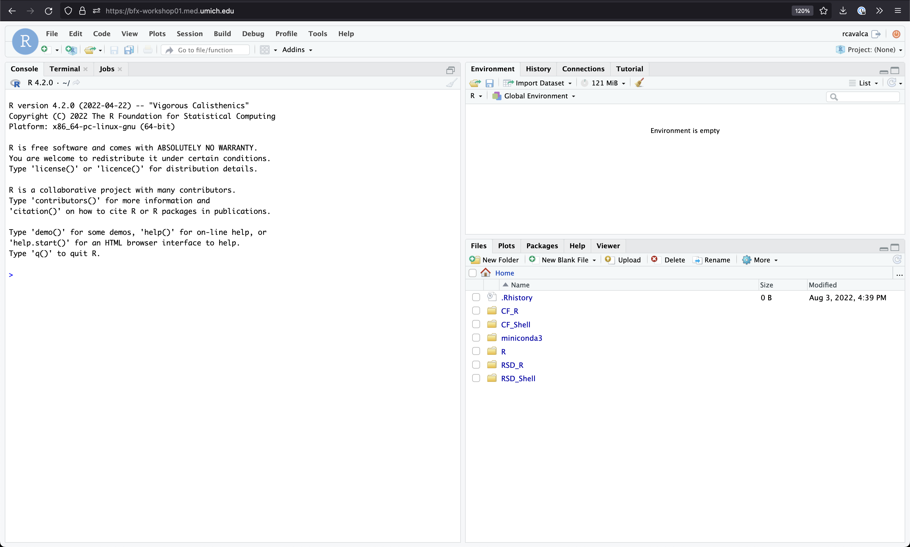
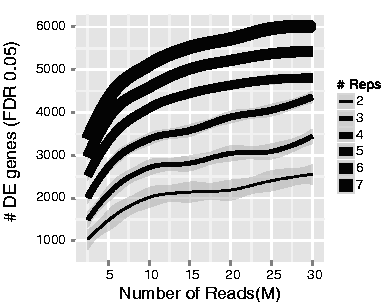

<style type="text/css">
body, td {
   font-size: 18px;
}
code.r{
  font-size: 12px;
}
pre {
  font-size: 12px
}
</style>

```{r, include = FALSE}
source("../bin/chunk-options.R")
knitr_fig_path("06-")
```

> # Objectives {.unlisted .unnumbered}
> * Overview of reproducible research & analysis setup
> * Broad introduction to DESeq2 & why it is widely used for differential expression comparisons
> * How to import and review gene count table


# Differential Expression Workflow {.unlisted .unnumbered}

Today we will proceed through key steps in a differential expression analysis, starting from a count table that's similar to what you generated in the first half of the workshop and similar to one of the outputs included in the [data that the Advanced Genomics Core delivers](https://brcf.medicine.umich.edu/cores/advanced-genomics/data-delivery/) for RNA-seq libraries.


# Getting Started in RStudio

## Log on to RStudio Server

Open a web browser to the following URL: [http://bfx-workshop01.med.umich.edu](http://bfx-workshop01.med.umich.edu)

You should now be looking at a page that will allow you to login to the RStudio server:


Enter your user credentials and click <kbd>Sign In</kbd>. The credentials were provided via email, but if you forget yours, a helper can retrieve it for you, just ask in Slack. You should now see the RStudio interface:



## Create an RStudio Project

In the Computational Foundation workshop we created a project rooted in a particular directory and stored our data, scripts and output within that project. Let's do the same thing, but for the differential expression part of this workshop.

1. To create a project, go to the <kbd>File</kbd> menu, and click <kbd>New Project...</kbd>. The following window will appear:


2. In this window, select <kbd>Existing Directory</kbd>. For "Project working directory", click <kbd>Browse...</kbd>, select the "RSD_R" folder, and click <kbd>Choose</kbd>. This will use the `/home/workshop/user/RSD_R` folder as the project directory.

3. Finally click <kbd>Create Project</kbd>. In the "Files" tab of your output pane (more about the RStudio layout in a moment), you should see an RStudio project file, **RSD_R.Rproj**. All RStudio projects end with the "**.Rproj**" file extension.

Note that there is already a `data/` folder which contains the data we will use for these lessons.

## Creating an R script

Let's create an R script file to store all the code we're going to run in the forthcoming lessons.

- Click the <kbd>File</kbd> menu and select <kbd>New File</kbd> and then <kbd>R Script</kbd>.
- Before we go any further, save your script by clicking the save/disk icon that is in the bar above the first line in the script editor, or click the <kbd>File</kbd> menu and select <kbd>Save</kbd>.
- In the "Save File" window that opens, select <kbd>New Folder</kbd>. Name it **"scripts"**.
- Finally, name your file **"diffex"** in the "File name" field.

The new script **diffex.R** is now in the `scripts` folder. You can see that by clicking the `scripts` folder in the "Files" pane. And you can go back up to the main project folder by clicking the `..` to the right of the up arrow in the "Files" pane. By convention, R scripts end with the file extension **.R**.

# Reproducible research

Today we'll be exploring some RNA-seq data that is fairly representative of what we see in the core and start with input files similar to the count table you generated in the previous steps and similar to one of the outputs currently being delivered by the Advanced Sequencing Core.

## File organization

As widely discussed, including in a review by [Nobel, 2009](https://journals.plos.org/ploscompbiol/article?id=10.1371/journal.pcbi.1000424), file organization and data stewardship are an important parts of reproducible research.

To follow best practices for file organization for bioinformatics/computational projects, we should make distinct locations for:

* Raw data
* Code
* Output

Such as illustrated in this figure from the Noble review:


To organize our files for our analysis today, we'll create some directories in the `RSD_R` folder which is now our project root and current working directory. We can already see that there a `data/` folder and we just created the `scripts/` folder with the RStudio GUI. Let's create an `outputs/` folder using the `dir.create()` function in R.

```{r create_dirs, eval = FALSE}
dir.create('outputs')
dir.create('outputs/figures')
dir.create('outputs/tables')
```

**Checkpoint**: *Please use the green 'check' if you have saved your code file and see the `data`, `scripts`, and `outputs` directories in the `RSD_R` folder and the red 'x' if you do not.*

> ## Reminder: RStudio code execution {.unlisted .unnumbered}
>
> <kbd>Ctrl</kbd>+<kbd>Enter</kbd> is a standard shortcut in RStudio to send the current line (or selected lines) to the console. If you see `>` in the Console, then R has executed the command. If you see a `+`, this means that the command is not complete, R thinks there is more to your command. You can use the <kmd>esc</kmd> to get out of this state.

> ## Reminder: Object naming conventions {.unlisted .unnumbered}
> * Cannot start with numbers
> * Cannot include dashes
> * Cannot have spaces
> * Should not be identical to a named function
> * Dots and underscores can separate parts of names, alternatively CamelCase accomplishes this

----

# Tools for Differential Gene Expression analysis

As discussed during the webinar, a common application for bulk RNA-seq is to test for differential expression between conditions or treatments, using statistical approaches that are appropriate for biological data.

While there are several tools that can be used for differential expression comparisons, we will use [DESeq2](https://bioconductor.org/packages/release/bioc/html/DESeq2.html) in our analysis today.

DESeq2 is one of two tools, along with [edgeR](https://bioconductor.org/packages/release/bioc/html/edgeR.html), considered ['best practice'](https://bmcbioinformatics.biomedcentral.com/articles/10.1186/1471-2105-14-91) for differential expression. Both tools apply similar methods that account for the distributions we expect to see for RNA-seq and are fairly stringent in calling differentially expressed genes, lowering the risk of investigating genes that were really false positives (e.g. don't really have different expression between treatment groups and therefore are not relevant to the biological process).

Additionally, DESeq2 also has an excellent vignette [(link)](https://bioconductor.org/packages/release/bioc/vignettes/DESeq2/inst/doc/DESeq2.html)
from Love, Anders, and Huber, from which our workflow is partially adapted, and is a good resource when analyzing your own data
(see also: [Love, Anders, and Huber. _Genome Biology_. 2014.](https://doi.org/10.1186/s13059-014-0550-8)).


<details>
    <summary>*Click for additional resources regarding statistical testing and tool comparison for RNA-seq data*</summary>
    To learn more about statistical testing and what distributions best model the behavior of RNA-seq data, a good resource is this [EdX lecture by Rafael Irizarry](https://www.youtube.com/watch?v=HK7WKsL3c2w&feature=youtu.be) or this [lecture by Kasper Hansen](https://www.youtube.com/watch?v=C8RNvWu7pAw). Another helpful guide is this [Comparative Study for Differential Expression Analysis by Zhang et al.](https://journals.plos.org/plosone/article?id=10.1371/journal.pone.0103207) from 2014.
</details>
<br>

## DESeq2 assumptions and requirements

A key assumption of DESeq2 is that *biological variance is much greater than technical variance* (especially if [best practices](https://www.txgen.tamu.edu/faq/rna-isolation-best-practices/) for [quality RNA isolation](https://www.biocompare.com/Bench-Tips/128790-Four-Tips-for-Perfecting-RNA-Isolation/) are followed, including DNase treatment!).

Since calculating variance is key to the statistical approach used for DESeq2, if we tried to compare two treatment groups with less than **two** replicates, we would get an error (as shown in [this blog post](https://support.bioconductor.org/p/89746/)). Without replicates, there can't be statistical significance (e.g. p-values), but *qualitative* approaches are an option, like looking at the top expressed genes after normalization.

## Replicates in RNA-seq experiments

A frequent question for RNA-seq projects is "How many replicates do I need?".

The general goal of our analyses is to separate the “interesting” biological contributions from the “uninteresting” technical or other contributions that either cannot be or were not controlled in the experimental design. The more sources of variation, such as samples coming from heterogenous tissues or experiments with incomplete knockdowns, the more replicates (>3) are recommended.

{width=75%}

For a more in depth discussion of experimental design considerations, particularly for the number of replicates, please read [A Beginner’s Guide to Analysis of RNA Sequencing Data](https://www.ncbi.nlm.nih.gov/pmc/articles/PMC6096346/) and papers like this one by [Hart et al](https://www.ncbi.nlm.nih.gov/pmc/articles/PMC3842884/) that focus on estimating statistical power for RNA-seq experiments.

## Sequencing depth recommendations

A related experimental design consideration is how much sequencing depth should be generated per sample. This figure shared by Illumina in their technical talks is helpful to understand the relative importance of replicates versus sequencing depth.

{width=75%}

Generally, for human and mouse experiments, the recommendation is 30-40 million reads per sample for polyA library preps to capture both highly expressed (abundant) and lowly expressed (rarer) transcripts, assuming that ~25,000 protein-coding genes would be measured. However, as the image above shows, sequencing depth has less of an impact than number of replicates in detecting differentially expressed genes (DEGs).

> ## Exercise: Building a better understanding of differential expression analysis {.unlisted .unnumbered}
>
> 1. Post a comment below regarding what key question/misconception regarding designing an RNA-seq experiment we were able to address **OR**
> 2. Post a question that that was NOT addressed but that you hope we will address in the later modules **OR**
> 3. Add a thumbs up to your favorite comment(s) to upvote it

----

# Getting started with analysis

## Load Packages

Several packages have already been installed on the server, so we can load them into our R session now. To do that we'll use the `library` function to load the required packages.

```{r Modules, message=FALSE, warning= FALSE, eval=TRUE}
library(DESeq2)
library(ggplot2)
library(tidyr)
library(dplyr)
library(matrixStats)
library(ggrepel)
library(pheatmap)
library(RColorBrewer)
library(data.table)
```

*Note: We expect to see some red messages in your console while these packages are loading*

R/RStudio has great resources for getting help, including [code 'cheatsheets'](https://www.rstudio.com/wp-content/uploads/2016/10/r-cheat-sheet-3.pdf) and package vignettes, like for [tidyr](https://cran.r-project.org/web/packages/tidyr/vignettes/tidy-data.html).

Since we loaded the libraries into our R session, we can see documentation out using the `?` operator.
```{r CheckDocumentaion}
?`DESeq2-package`
```

**Checkpoint**: *If you see the R documentation for DESeq2 pop up in your 'help' panel on the right, please indicate with the green 'check' button. If not please use the red 'x' button.*

## Read Counts

Another key assumption for DESeq2 is that the analysis will start with [un-normalized counts](http://bioconductor.org/packages/devel/bioc/vignettes/DESeq2/inst/doc/DESeq2.html#why-un-normalized-counts).

To begin our analysis, we'll read in the **raw** count data file, `gene_expected_count.txt` which is similar to what would be generated in the alignment steps (and what you would receive from AGC). We'll discuss later a few normalizations that can be helpful for us to understand how much a gene is expressed within or between samples, but normalized data **should not** be used as an input for DESeq2.

```{r DataTable, eval=TRUE, echo=FALSE}
## need to include paths relative to site build locations but keep code block hidden
count_table = read.table("../data/gene_expected_count.txt", header = TRUE, row.names = 1)
```

```{r DataTable2, eval=FALSE}
count_table = read.table("data/gene_expected_count.txt", header = TRUE, row.names = 1)
```

```{r DataTableCheck, eval=TRUE}
head(count_table, n=2) # look at the top of the table
```

Now that the file is read into R, note that we've created a data frame that includes 'gene ids' in ENSEMBL format as rownames and count data from twelve different samples.

> # Exercise: RSEM outputs versus DESeq2 input requirements {.unlisted .unnumbered}
>
> If we think back to the RSEM outputs, the 'expected_counts' table may include fractional amounts due to how the alignment tool resolves reads mapping to multiple locuses). DESeq2 is expecting the count matrix to consist only of whole numbers. Recent versions of DESeq2 will handle this for us, but previous versions did not.
>
> What function, that we saw early on in the Computational Foundations R lessons, could we use to convert fractional values in `count_table` to integers?

<details>
<summary>Solution</summary>

We can use the `round()` function:

```{r round count_table}
count_table = round(count_table)
```
</details>
<br>

# Getting help

R and RStudio have a strong community component so if you are getting an error or wondering how to make a command work or how to perform a specific task, there is likely already a solution out there. Remember that Google is your friend, although it can sometimes be a challenge to figure out *what to search for*. Key parts of a successful search:

* Package or command run
* `R` or `Bioconductor`
* The error message if there is one
* Version information

How to get session information to aid in a search:
```{r Session info, eval = FALSE, message = FALSE}
sessionInfo()
```

Highly recommend using resources like [Bioconductor Support](https://support.bioconductor.org/), [Biostars](https://www.biostars.org/), and [Stack Overflow](https://stackoverflow.com/questions/tagged/r), including threads on specific packages or common bioinformatic tasks.

I personally use one or more of these resources **every day**.

10x Genomics has a helpful [10 tips for biologists learning  bioinformatics](https://www.10xgenomics.com/resources/analysis-guides/10-tips-for-biologists-learning-bioinformatics) included in their resources.

# Summary

In this section, we:

* Set up our compute environment
* Learned about DESeq2
* Read a raw count table and saved it as a data frame

Now that we have our count data processed, we can move on to "unblinding" our data, as the sample names are unique identifiers generated by a sequencing center and not very informative as far as our experimental conditions.

---

# Optional content

An important note is that there are several bonus content sections on the instruction pages, like the two below that we will not be covering in this workshop, but that may have useful context or be helpful when you review this material.

<details>
    <summary>*Click for alternative DESeq2 input options for RSEM outputs*</summary>
    The package `tximport` is another option[recommended the DESeq2  authors](https://support.bioconductor.org/p/90672/) to read in the RSEM expected_counts, as this  package allows for the average transcript length per gene to be used in the DE analysis and, as [described by the author](https://support.bioconductor.org/p/88763/), the `tximport-to-DESeqDataSet` constructor function round the non-integer data generated by RSEM to whole numbers.
</details>
<br>
<details>
    <summary>*Click for comparison of RNA-seq data and microarray data*</summary>
    With [higher sensitivity, greater flexiblity, and decreasing cost](https://www.illumina.com/science/technology/next-generation-sequencing/microarray-rna-seq-comparison.html), sequencing has largely replaced microarray assays for measuring gene expression. A key difference between the platforms is that microarrays measure intensities and are therefore *continous* data while the count data from sequencing is *discrete*. A more detailed comparison between microarrays and sequencing technologies/analysis is outlined in [the online materials for Penn State's STAT555 course](https://online.stat.psu.edu/stat555/node/30/)

</details>
<br>

# Sources

Training resources used to develop materials:

* HBC DGE setup: https://hbctraining.github.io/DGE_workshop/lessons/01_DGE_setup_and_overview.html
* HBC Count Normalization: https://hbctraining.github.io/DGE_workshop/lessons/02_DGE_count_normalization.html
* DESeq2 standard vignette: http://bioconductor.org/packages/devel/bioc/vignettes/DESeq2/inst/doc/DESeq2.html
* DESeq2 beginners vignette: https://bioc.ism.ac.jp/packages/2.14/bioc/vignettes/DESeq2/inst/doc/beginner.pdf
* Bioconductor RNA-seq Workflows: https://www.bioconductor.org/help/course-materials/2015/LearnBioconductorFeb2015/B02.1_RNASeq.html
* CCDL Gastric cancer training materials: https://alexslemonade.github.io/training-modules/RNA-seq/03-gastric_cancer_exploratory.nb.html
* CCDL Neuroblastoma training materials: https://alexslemonade.github.io/training-modules/RNA-seq/05-nb_cell_line_DESeq2.nb.html


```{r WriteOut.RData, eval=TRUE, echo=FALSE, message=FALSE}
#Hidden code block to write out data for knitting

# dir.create("rdata", showWarnings=FALSE)
# save.image(file = "rdata/RunningData.RData")
# How to load for next segment
# load("rdata/RunningData.RData")
```

---

These materials have been adapted and extended from materials listed above. These are open access materials distributed under the terms of the [Creative Commons Attribution license (CC BY 4.0)](http://creativecommons.org/licenses/by/4.0/), which permits unrestricted use, distribution, and reproduction in any medium, provided the original author and source are credited.
