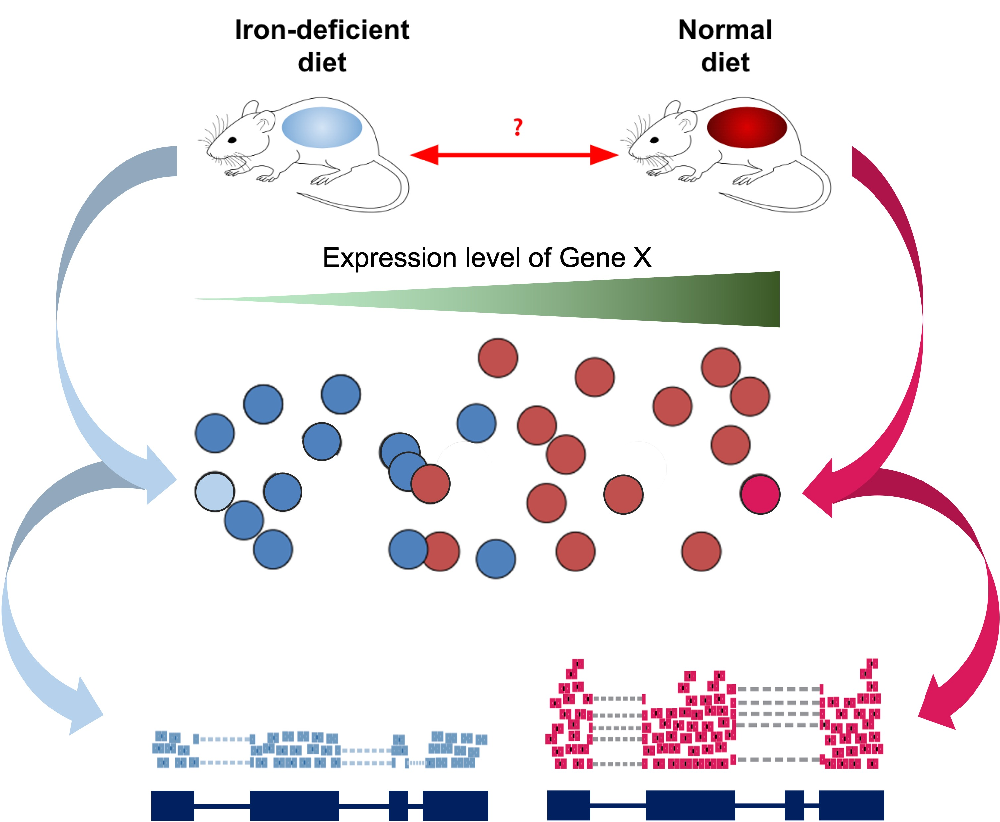

<style type="text/css">
body, td {
   font-size: 18px;
}
code.r{
  font-size: 12px;
}
pre {
  font-size: 12px
}
</style>

```{r, include = FALSE}
source("../bin/chunk-options.R")
knitr_fig_path("07-")
```

```{r LoadRunningData, eval=TRUE, echo=FALSE, message=FALSE, warning=FALSE}
library(DESeq2)
# load("rdata/RunningData.RData")
```

> # Objectives {.unlisted .unnumbered}
> * 'Unblind' our sample IDs
> * Understand possible confounding factors
> * Understand the impact of batches or additional covariates
> * Filter count table

# Differential Expression Workflow {.unlisted .unnumbered}

Here we will proceed setting up the inputs needed to initialize DESeq2 before testing for differential expression.

{width=75%}

---

# DESeq2 objects

Bioconductor software packages often define and use custom classes within R to store data in a way that better fits expectations around biological data, such as illustrated below from [Huber et al. 2015](https://www.nature.com/articles/nmeth.3252).


These custom data structures have pre-specified data slots, which hold specific types/classes of data and therefore can be more easily accessed by functions from the same package.

To create the DESeqDataSet we need two tables:

1. A count matrix (which we already loaded and saved as the object `count_table`) and
2. A table that assigns the condition labels for each sample (which we will generate below).

# Sample Information

As introduced at the beginning of the workshop, we have downloaded and prepared data from an existing publication [(Zhang et al., 2019)](https://elifesciences.org/articles/46976), wherein one goal is to understand the gene expression differences in wild-type mice that are "iron replete" (we label these "plus") and "iron deficient" (we label these "minus").



## Read Sample Table

Our next step will be to describe the samples within our R session, so that we make the proper comparisons with DESeq2. Let's check the sample names from the count table.

```{r ColumnNames}
colnames(count_table)
```

Based on the sample names that are the columns of `count_table`, our samples are blinded, e.g. the sample names don't clearly correspond to treatment groups. We will need to specify which sample IDs connect to which experimental conditions.

Typically sample phenotype data, including experimental conditions, are stored as Excel or CSV files that we can read into R, and then use when creating a DESeq2 object. If you are unfamilar with CSV files or how to generate them, there are [tutorials](https://www.wikihow.com/Create-a-CSV-File) available to guide you through the process.

> # Tip: Sample naming conventions {.unlisted .unnumbered}
> Use only alpha-numeric characters (A-Z, a-z, 0-9), and separate parts of the name with underscores (`_`) or dots (`.`). Do not begin sample names with numbers.

We'll load our 'pre-made' sample information sheet, `samplesheet.csv`, to unblind our samples.

```{r Samplesheet, echo = FALSE, eval = TRUE}
samplesheet = read.table("../data/samplesheet.csv",
                       sep = ",",
                       header = TRUE,
                       row.names = 1)
```

```{r Samplesheet2, eval = FALSE}
samplesheet = read.table("data/samplesheet.csv",
                       sep = ",",
                       header = TRUE,
                       row.names = 1)
```

We can look at the object by typing its name and hitting Enter. Note, for larger experiments, you may want to use `head()`.

```{r ShowSamplesheet}
samplesheet
```

**Checkpoint**: *If you have loaded `samplesheet`, please indicate with the green 'check' button. Otherwise, please use the red 'x' button to have the command repeated*

Again, all mice are wild-type in this example data, and the iron replete mice are labeled as "plus" and the iron deficient mice are labeled as "minus". Again, for larger experiments, you may want to examine the coding of the samples by looking at the `unique()` values of the relevant columns.

```{r TreatmentGroupTable}
unique(samplesheet$condition)
```

Next, we'll format our table so that we have the appropriate data type (an ordered [factor](https://swcarpentry.github.io/r-novice-inflammation/12-supp-factors/)) for DESeq2 to recognize our treatment groups and appropriately compare samples.

```{r SamplesheetFactor}

samplesheet$condition = factor(samplesheet$condition,
                            levels = c('plus', 'minus'))

unique(samplesheet$condition)
```

Notice that we set the levels in a particular order. This is important for setting the "Control" (or "Reference") group as the denominator in our comparisons when we setup our DESeq2 model.

Before we proceed, we need to make sure that the sample labels (column names) in the count table match the sample information table (row names), including the order. If the sample labels don't match, then we will see an error and need to correct the labels prior to proceeding. Checking the sample information table is extremely important to ensure that the correct samples are grouped together for comparisons.

```{r CheckSamplesheet}
all(colnames(count_table) == rownames(samplesheet))
```
This line of code checks if both the identity and order match between our `count_table` and our `samplesheet`. If, in the course of using your own data, this returns `FALSE`, try using the `match()` function to rearrange the columns of `count_table` (or the rows of `samplesheet`) to get them to match.

**Checkpoint**: *If you your sample info check returns `TRUE`, please indicate with the green 'yes' button. Otherwise, please use the red 'x' button to have the command repeated*

# Creating DESeq2 object

To create the `DESeqDataSet` we will need the `count_table` and the `samplesheet`. We will also need a **design formula** to specify our model.

## Making model choices

The design formula specified informs many of the DESeq2 functions how to treat the samples in the analysis, specifically which column(s) in the sample metadata table are relevant to the experimental design.

In this case, we aren't aware of any [covariates](https://methods-sagepub-com.proxy.lib.umich.edu/reference/encyc-of-research-design/n85.xml) that should be considered in our comparisons. However, if there are additional attributes of the samples that may impact the DE comparisons, like sex, date of collection, or patient of origin, these should be added as [additional columns](https://support.bioconductor.org/p/75309/) in the sample information table and [added to a design formula](https://support.bioconductor.org/p/98700/).

More complex questions, including adding "interaction terms" are helpfully described in [this support thread](https://support.bioconductor.org/p/98628/) as well as in the [DESeq2 vignette](https://bioconductor.org/packages/release/bioc/vignettes/DESeq2/inst/doc/DESeq2.html#interactions), which is an excellent document.

The design formula specifies the column(s) in the metadata table and how they should be used in the analysis. For our dataset we only have one column we are interested in, that is `condition`. This column has two factor levels, which tells DESeq2 that for each gene we want to evaluate gene expression change with respect to these different levels.

```{r DESeq2Object}
## Create DESeq object, line by line
dds = DESeqDataSetFromMatrix(countData = count_table,
                              colData = samplesheet,
                              design = ~ condition)
dds
```

Notice that printing the `dds` object helpfully shows us some helpful information:

* The dimension (number of genes by number of samples),
* The gene identifiers,
* The sample identifiers,
* The additional column names giving information about the samples

**Checkpoint**: *If you see `dds` in your environment panel, please indicate with the green 'check' button. Otherwise, please use  use the red 'x' button in your zoom reaction panel to have this step repeated. You can use the red 'x' to be put in a breakout room for help*

---


# Pre-filtering

While not necessary, [pre-filtering](http://bioconductor.org/packages/devel/bioc/vignettes/DESeq2/inst/doc/DESeq2.html#pre-filtering) the count table helps to not only reduce the size of the DESeq2 object, but also gives you a sense of how many genes were reasonably measured at the sequencing depth generated for your samples.

Here we will filter out any genes that have less than 10 counts across any of the samples. This is a fairly standard level of filtering, but can filter data less/more depending on quality control metrics from alignments and sequencing depth or total number of samples.

```{r PreFilter}
keep = rowSums(counts(dds)) >= 10
dds = dds[keep,]
dds
```

Notice the `dds` object has less elements after filtering. There were quite a number of genes that were not measured in our experiment.

**Checkpoint**: *Questions?*

# Optional content

<details>
    <summary>*Click for how to model batch effects with DESeq2*</summary>

    Differences between samples can also be due to technical reasons, such as collection on different days or different sequencing runs. Differences between samples that are not due to biological factors as called **batch effects**. We can include batch effects in our design model in the same way as covariates, as long as the technical groups do not overlap, or **confound**, the biological treatment groups.

    Let's try add some additional meta-data information where we have counfounding batch effects and create another DESeq2 object.

```{r Confounders}
samplesheet_batch = samplesheet
samplesheet_batch$batch = factor(c(rep(c("Day1"), 2),
                       rep(c("Day2"), 2),
                       rep(c("Day3"), 2)),
                     levels = c("Day1", "Day2", "Day3"))

dds_batch = DESeqDataSetFromMatrix(countData = count_table,
                      colData = samplesheet_batch,
                      design = ~ batch + condition)
```
</details>
<br>

# Summary

In this section, we:

* Loaded the necessary input files into our R session
* Discussed model design for DESeq2
* Initialized a DESeq2 data set
* Filtered our count data

Now that we've created our DESeq2 objects, including specifying what model is appropriate for our data, and filtered our data, we can proceed with assessing the impact of the experimental conditions on gene expression across our samples.

---

# Sources

Training resources used to develop materials:

* HBC DGE setup: https://hbctraining.github.io/DGE_workshop/lessons/01_DGE_setup_and_overview.html
* HBC Count Normalization: https://hbctraining.github.io/DGE_workshop/lessons/02_DGE_count_normalization.html
* DESeq2 standard vignette: http://bioconductor.org/packages/devel/bioc/vignettes/DESeq2/inst/doc/DESeq2.html
* DESeq2 beginners vignette: https://bioc.ism.ac.jp/packages/2.14/bioc/vignettes/DESeq2/inst/doc/beginner.pdf
* Bioconductor RNA-seq Workflows: https://www.bioconductor.org/help/course-materials/2015/LearnBioconductorFeb2015/B02.1_RNASeq.html
* CCDL Gastric cancer training materials: https://alexslemonade.github.io/training-modules/RNA-seq/03-gastric_cancer_exploratory.nb.html
* CCDL Neuroblastoma training materials: https://alexslemonade.github.io/training-modules/RNA-seq/05-nb_cell_line_DESeq2.nb.html


```{r WriteOut.RData, eval=TRUE, echo=FALSE, message=FALSE, warning=FALSE}
# Hidden code block to write out data for knitting
# save.image(file = "rdata/RunningData.RData")
```

---

These materials have been adapted and extended from materials listed above. These are open access materials distributed under the terms of the [Creative Commons Attribution license (CC BY 4.0)](http://creativecommons.org/licenses/by/4.0/), which permits unrestricted use, distribution, and reproduction in any medium, provided the original author and source are credited.
